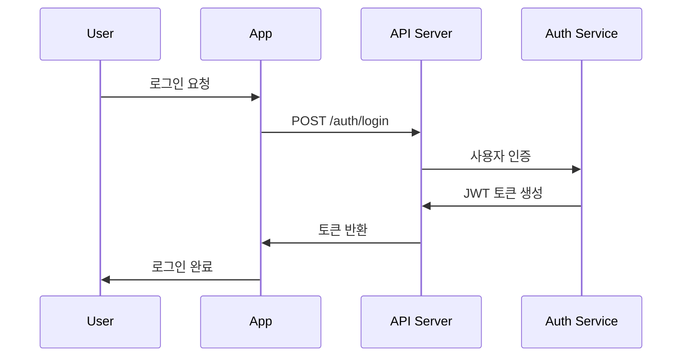

# PeakPal 기능설계서

## 1. 시스템 아키텍처 개요

### 1.1 전체 시스템 구조
```
┌─────────────────┐    ┌─────────────────┐    ┌─────────────────┐
│   Mobile App    │    │   API Gateway   │    │   Backend API   │
│  (React Native) │◄──►│   (AWS ALB)     │◄──►│   (Node.js)     │
└─────────────────┘    └─────────────────┘    └─────────────────┘
         │                        │                        │
         ▼                        ▼                        ▼
┌─────────────────┐    ┌─────────────────┐    ┌─────────────────┐
│   Local Storage │    │   CDN/Assets    │    │   Database      │
│   (SQLite)      │    │   (AWS S3)      │    │ (PostgreSQL +   │
└─────────────────┘    └─────────────────┘    │  MongoDB)       │
                                             └─────────────────┘
```

### 1.2 마이크로서비스 구조
- **User Service**: 사용자 관리, 인증/인가
- **Tracking Service**: GPS 트래킹, 위치 데이터 처리
- **Map Service**: 지도 데이터, 등산로 정보
- **Community Service**: 커뮤니티, 게시물, 댓글
- **Safety Service**: SOS, 응급상황 처리
- **Analytics Service**: 통계, 분석, 리포트

## 2. 상세 기능 설계

### 2.1 사용자 관리 시스템

#### 2.1.1 인증/인가 흐름


#### 2.1.2 사용자 데이터 모델
```typescript
interface User {
  id: string;
  email: string;
  nickname: string;
  profileImage?: string;
  level: 'BEGINNER' | 'INTERMEDIATE' | 'ADVANCED';
  preferences: {
    difficultyPreference: string[];
    notificationSettings: NotificationSettings;
    privacySettings: PrivacySettings;
  };
  statistics: UserStatistics;
  createdAt: Date;
  updatedAt: Date;
}

interface UserStatistics {
  totalHikes: number;
  totalDistance: number;
  totalElevation: number;
  totalTime: number;
  favoriteTrails: string[];
}
```

### 2.2 GPS 트래킹 시스템

#### 2.2.1 위치 추적 알고리즘
```typescript
class LocationTracker {
  private watchId: number;
  private trackingData: TrackingPoint[] = [];
  
  startTracking(): void {
    this.watchId = navigator.geolocation.watchPosition(
      this.onLocationUpdate.bind(this),
      this.onLocationError.bind(this),
      {
        enableHighAccuracy: true,
        timeout: 10000,
        maximumAge: 5000
      }
    );
  }
  
  private onLocationUpdate(position: GeolocationPosition): void {
    const point: TrackingPoint = {
      latitude: position.coords.latitude,
      longitude: position.coords.longitude,
      altitude: position.coords.altitude,
      accuracy: position.coords.accuracy,
      timestamp: new Date(),
      speed: this.calculateSpeed(position)
    };
    
    this.addTrackingPoint(point);
    this.updateRealTimeStats(point);
  }
}
```

#### 2.2.2 트래킹 데이터 구조
```typescript
interface TrackingSession {
  id: string;
  userId: string;
  trailId?: string;
  startTime: Date;
  endTime?: Date;
  status: 'ACTIVE' | 'PAUSED' | 'COMPLETED' | 'CANCELLED';
  trackingPoints: TrackingPoint[];
  statistics: SessionStatistics;
  photos: Photo[];
  notes: string[];
}

interface TrackingPoint {
  latitude: number;
  longitude: number;
  altitude?: number;
  accuracy: number;
  timestamp: Date;
  speed?: number;
  heading?: number;
}

interface SessionStatistics {
  totalDistance: number;
  totalTime: number;
  elevationGain: number;
  elevationLoss: number;
  maxSpeed: number;
  averageSpeed: number;
  maxAltitude: number;
  minAltitude: number;
  calories: number;
}
```

### 2.3 지도 및 내비게이션 시스템

#### 2.3.1 지도 컴포넌트 구조
```typescript
interface MapComponent {
  // 기본 지도 설정
  initialRegion: Region;
  mapType: 'standard' | 'satellite' | 'terrain';
  
  // 사용자 위치
  showUserLocation: boolean;
  followUserLocation: boolean;
  
  // 등산로 오버레이
  trails: Trail[];
  selectedTrail?: Trail;
  
  // 마커 및 POI
  markers: MapMarker[];
  pointsOfInterest: POI[];
  
  // 이벤트 핸들러
  onRegionChange: (region: Region) => void;
  onMarkerPress: (marker: MapMarker) => void;
  onTrailSelect: (trail: Trail) => void;
}

interface Trail {
  id: string;
  name: string;
  difficulty: 'EASY' | 'MODERATE' | 'HARD';
  distance: number;
  estimatedTime: number;
  elevationGain: number;
  coordinates: Coordinate[];
  waypoints: Waypoint[];
  description: string;
  rating: number;
}
```

#### 2.3.2 오프라인 지도 시스템
```typescript
class OfflineMapManager {
  private downloadQueue: MapTileRequest[] = [];
  private storage: AsyncStorage;
  
  async downloadMapArea(bounds: GeoBounds, zoomLevels: number[]): Promise<void> {
    const tiles = this.calculateRequiredTiles(bounds, zoomLevels);
    
    for (const tile of tiles) {
      await this.downloadTile(tile);
    }
  }
  
  async getTile(x: number, y: number, z: number): Promise<MapTile | null> {
    // 로컬 스토리지에서 먼저 확인
    const localTile = await this.storage.getItem(`tile_${z}_${x}_${y}`);
    if (localTile) {
      return JSON.parse(localTile);
    }
    
    // 온라인에서 다운로드
    return this.downloadTile({ x, y, z });
  }
}
```

### 2.4 안전 관리 시스템

#### 2.4.1 SOS 기능 설계
```typescript
class EmergencyService {
  private sosActive: boolean = false;
  private emergencyContacts: EmergencyContact[];
  
  async activateSOS(): Promise<void> {
    this.sosActive = true;
    
    // 현재 위치 확보
    const location = await this.getCurrentLocation();
    
    // 동시 실행
    await Promise.all([
      this.sendLocationToEmergencyServices(location),
      this.notifyEmergencyContacts(location),
      this.broadcastToNearbyUsers(location),
      this.startContinuousLocationSharing()
    ]);
  }
  
  private async sendLocationToEmergencyServices(location: Location): Promise<void> {
    const emergencyData = {
      location: location,
      userInfo: await this.getUserInfo(),
      timestamp: new Date(),
      emergencyType: 'HIKING_EMERGENCY'
    };
    
    // 119, 지역 구조대, 국립공원관리공단 등에 전송
    await this.sendTo119(emergencyData);
    await this.sendToLocalRescue(emergencyData);
  }
}
```

#### 2.4.2 위험 지역 감지
```typescript
class HazardDetectionService {
  private hazardZones: HazardZone[] = [];
  
  checkLocationForHazards(location: Location): HazardAlert[] {
    const alerts: HazardAlert[] = [];
    
    for (const zone of this.hazardZones) {
      if (this.isLocationInZone(location, zone)) {
        alerts.push({
          type: zone.hazardType,
          severity: zone.severity,
          message: zone.warningMessage,
          recommendations: zone.recommendations
        });
      }
    }
    
    return alerts;
  }
  
  private isLocationInZone(location: Location, zone: HazardZone): boolean {
    // 지리적 경계 확인 (Polygon containment)
    return this.pointInPolygon(location, zone.boundaries);
  }
}

interface HazardZone {
  id: string;
  name: string;
  hazardType: 'CLIFF' | 'LANDSLIDE' | 'FLASH_FLOOD' | 'WILD_ANIMAL' | 'WEATHER';
  severity: 'LOW' | 'MEDIUM' | 'HIGH' | 'CRITICAL';
  boundaries: Coordinate[];
  warningMessage: string;
  recommendations: string[];
  isActive: boolean;
}
```

### 2.5 커뮤니티 시스템

#### 2.5.1 게시물 관리
```typescript
interface CommunityPost {
  id: string;
  authorId: string;
  type: 'REVIEW' | 'COMPANION_SEARCH' | 'TIP' | 'PHOTO';
  title: string;
  content: string;
  trailId?: string;
  trackingSessionId?: string;
  photos: string[];
  tags: string[];
  visibility: 'PUBLIC' | 'FRIENDS' | 'PRIVATE';
  
  // 상호작용
  likes: string[]; // user IDs
  comments: Comment[];
  shares: number;
  
  // 메타데이터
  createdAt: Date;
  updatedAt: Date;
  location?: Location;
}

interface Comment {
  id: string;
  authorId: string;
  content: string;
  parentCommentId?: string; // 대댓글 지원
  createdAt: Date;
  likes: string[];
}
```

#### 2.5.2 동행자 매칭 시스템
```typescript
class CompanionMatchingService {
  async findCompanions(request: CompanionRequest): Promise<CompanionMatch[]> {
    const candidates = await this.getCandidates(request);
    
    return candidates.map(candidate => ({
      user: candidate,
      compatibilityScore: this.calculateCompatibility(request, candidate),
      sharedInterests: this.findSharedInterests(request, candidate),
      distanceFromMeetingPoint: this.calculateDistance(
        request.meetingPoint, 
        candidate.preferredLocation
      )
    }));
  }
  
  private calculateCompatibility(
    request: CompanionRequest, 
    candidate: User
  ): number {
    let score = 0;
    
    // 등산 레벨 호환성
    if (this.isLevelCompatible(request.preferredLevel, candidate.level)) {
      score += 30;
    }
    
    // 선호 시간대
    if (this.isTimeCompatible(request.preferredTime, candidate.availableTime)) {
      score += 25;
    }
    
    // 선호 등산로 타입
    score += this.calculateTrailTypeCompatibility(request, candidate) * 20;
    
    // 사용자 평점
    score += candidate.rating * 25;
    
    return Math.min(score, 100);
  }
}
```

### 2.6 데이터 동기화 시스템

#### 2.6.1 오프라인/온라인 동기화
```typescript
class DataSyncService {
  private syncQueue: SyncItem[] = [];
  private isOnline: boolean = true;
  
  async syncData(): Promise<void> {
    if (!this.isOnline) {
      console.log('오프라인 상태: 동기화 대기 중');
      return;
    }
    
    while (this.syncQueue.length > 0) {
      const item = this.syncQueue.shift();
      try {
        await this.processSyncItem(item);
      } catch (error) {
        // 실패한 항목을 다시 큐에 추가
        this.syncQueue.unshift(item);
        break;
      }
    }
  }
  
  addToSyncQueue(type: SyncType, data: any): void {
    this.syncQueue.push({
      id: generateId(),
      type: type,
      data: data,
      timestamp: new Date(),
      retryCount: 0
    });
  }
}

interface SyncItem {
  id: string;
  type: 'TRACKING_DATA' | 'USER_PROFILE' | 'COMMUNITY_POST' | 'PHOTO';
  data: any;
  timestamp: Date;
  retryCount: number;
}
```

## 3. 성능 최적화 설계

### 3.1 배터리 최적화
```typescript
class BatteryOptimizer {
  private batteryLevel: number = 100;
  private isLowPowerMode: boolean = false;
  
  optimizeForBatteryLevel(): void {
    if (this.batteryLevel < 20) {
      this.enableLowPowerMode();
    } else if (this.batteryLevel < 50) {
      this.enableMediumPowerMode();
    }
  }
  
  private enableLowPowerMode(): void {
    this.isLowPowerMode = true;
    
    // GPS 업데이트 주기 증가 (5초 → 15초)
    LocationTracker.setUpdateInterval(15000);
    
    // 지도 렌더링 품질 감소
    MapComponent.setRenderQuality('low');
    
    // 백그라운드 동기화 중단
    DataSyncService.pauseBackgroundSync();
  }
}
```

### 3.2 메모리 관리
```typescript
class MemoryManager {
  private maxTrackingPoints: number = 10000;
  
  manageTrackingData(points: TrackingPoint[]): TrackingPoint[] {
    if (points.length > this.maxTrackingPoints) {
      // 오래된 포인트를 압축하여 저장
      return this.compressOldPoints(points);
    }
    return points;
  }
  
  private compressOldPoints(points: TrackingPoint[]): TrackingPoint[] {
    const recentPoints = points.slice(-5000); // 최근 5000개 유지
    const oldPoints = points.slice(0, -5000);
    
    // 오래된 포인트는 간격을 늘려서 압축
    const compressedOldPoints = this.downsample(oldPoints, 10);
    
    return [...compressedOldPoints, ...recentPoints];
  }
}
```

## 4. 보안 설계

### 4.1 데이터 암호화
```typescript
class SecurityService {
  private encryptionKey: string;
  
  encryptLocationData(data: TrackingPoint[]): string {
    return CryptoJS.AES.encrypt(JSON.stringify(data), this.encryptionKey).toString();
  }
  
  decryptLocationData(encryptedData: string): TrackingPoint[] {
    const bytes = CryptoJS.AES.decrypt(encryptedData, this.encryptionKey);
    return JSON.parse(bytes.toString(CryptoJS.enc.Utf8));
  }
  
  generateSecureToken(): string {
    return CryptoJS.lib.WordArray.random(256/8).toString(CryptoJS.enc.Hex);
  }
}
```

### 4.2 개인정보 보호
```typescript
class PrivacyManager {
  anonymizeLocationData(data: TrackingPoint[]): TrackingPoint[] {
    return data.map(point => ({
      ...point,
      // 위치 정보를 100m 그리드로 라운딩
      latitude: this.roundToGrid(point.latitude, 0.001),
      longitude: this.roundToGrid(point.longitude, 0.001)
    }));
  }
  
  getUserConsent(dataType: DataType): Promise<boolean> {
    return new Promise((resolve) => {
      // 사용자에게 동의 요청 UI 표시
      this.showConsentDialog(dataType, resolve);
    });
  }
}
```

## 5. 에러 처리 및 로깅

### 5.1 글로벌 에러 핸들링
```typescript
class ErrorHandler {
  static handleError(error: Error, context: string): void {
    console.error(`[${context}] ${error.message}`, error.stack);
    
    // 중요한 에러는 서버로 전송
    if (this.isCriticalError(error)) {
      this.reportToServer(error, context);
    }
    
    // 사용자에게 적절한 메시지 표시
    this.showUserFriendlyMessage(error);
  }
  
  private static isCriticalError(error: Error): boolean {
    return error.name === 'LocationError' || 
           error.name === 'NetworkError' ||
           error.message.includes('SOS');
  }
}
```

## 6. 테스트 설계

### 6.1 단위 테스트
```typescript
// LocationTracker.test.ts
describe('LocationTracker', () => {
  let tracker: LocationTracker;
  
  beforeEach(() => {
    tracker = new LocationTracker();
  });
  
  test('should calculate distance correctly', () => {
    const point1 = { latitude: 37.5665, longitude: 126.9780 };
    const point2 = { latitude: 37.5675, longitude: 126.9790 };
    
    const distance = tracker.calculateDistance(point1, point2);
    expect(distance).toBeCloseTo(157.2, 1); // meters
  });
  
  test('should detect when user stops moving', () => {
    const stationaryPoints = generateStationaryPoints();
    stationaryPoints.forEach(point => tracker.addPoint(point));
    
    expect(tracker.isUserStationary()).toBe(true);
  });
});
```

### 6.2 통합 테스트
```typescript
// API Integration Test
describe('Tracking API Integration', () => {
  test('should save tracking session to server', async () => {
    const session = createMockTrackingSession();
    
    const response = await trackingAPI.saveSession(session);
    
    expect(response.status).toBe(201);
    expect(response.data.id).toBeDefined();
  });
});
```

---

**문서 버전**: 1.0  
**작성일**: 2025-05-22  
**검토자**: 기술 책임자, 시니어 개발자  
**승인일**: TBD