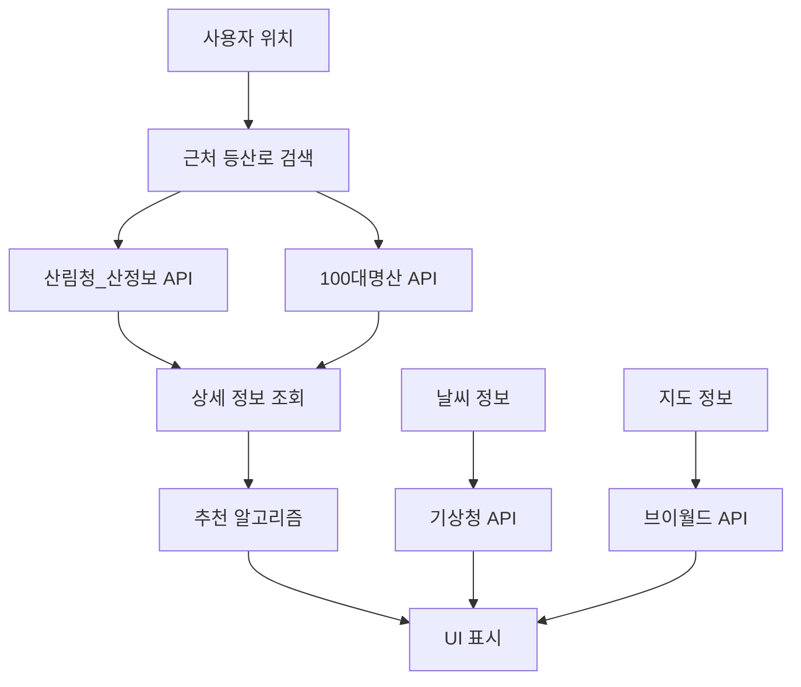
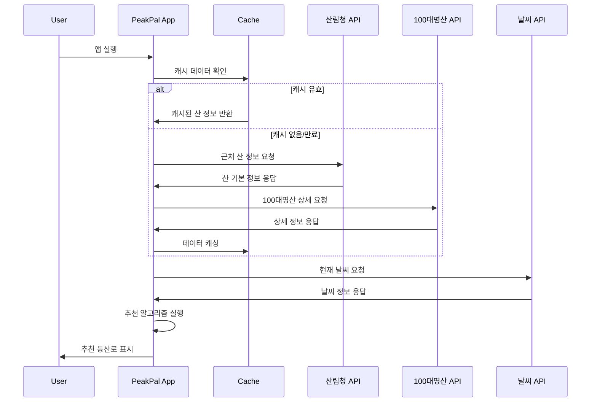

# PeakPal 공공데이터 API 연동 설계서

일반 인증키
(Encoding)	
4xuu5CiDRnUqx15NNFQekvjpPw3NogwcDEW%2BngHxuQsQnfMEVaPT0xJy5Ts%2BSLvo6UwCE74DrPO4RvBkNYd50g%3D%3D
일반 인증키
(Decoding)	
4xuu5CiDRnUqx15NNFQekvjpPw3NogwcDEW+ngHxuQsQnfMEVaPT0xJy5Ts+SLvo6UwCE74DrPO4RvBkNYd50g==


## 1. 개요 및 목적

### 1.1 설계 목적
- 공공데이터포털의 GW방식 API를 활용하여 PeakPal UI에 필요한 등산로 정보 제공
- Swagger 기반 OpenAPI 명세서 활용으로 안정적인 API 연동 구현
- 사용자 경험 최적화를 위한 효율적인 데이터 처리 구조 설계

### 1.2 참조 문서 분석
- **공공데이터포털 GW방식 가이드** 기반 API 연동 방식 적용
- **Base URL**: `apis.data.go.kr/{기관코드}/{서비스명}`
- **통신 프로토콜**: HTTPS GET 방식
- **인증 방식**: serviceKey 파라미터 (Decoding 방식)

## 2. API 연동 대상 및 매핑

### 2.1 PeakPal UI 화면별 필요 데이터

#### **홈 화면 (추천 등산로)**
```yaml
UI 요구사항:
  - 🥾 추천 등산로
  - 북한산 백운대 코스
  - 난이도: 중급 ⭐⭐⭐
  - 거리: 5.2km | 소요시간: 3시간
  - ⭐⭐⭐⭐ 4.2 (1,247개 리뷰)

필요 API:
  1. 산림청_산정보 서비스
  2. 한국등산트레킹지원센터_100대명산 목록정보
  3. 산림청_명산등산로
```

#### **트래킹 화면 (실시간 정보)**
```yaml
UI 요구사항:
  - 이동거리, 경과시간, 평균속도
  - 상승고도, 현재고도, 칼로리
  - 실시간 위치 및 목적지 정보

필요 API:
  1. 브이월드(VWorld) 등산로 공간정보
  2. 기상청 날씨 API (위치 기반)
```

#### **기록 화면 (등산 이력)**
```yaml
UI 요구사항:
  - 월간 통계 (횟수, 총 거리, 상승고도)
  - 등산 기록 목록 (산명, 날짜, 소요시간, 거리, 완주여부)

필요 API:
  1. 로컬 DB 기반 (API 직접 연동 없음)
  2. 산림청 API로 산 정보 검증
```

### 2.2 API 우선순위 및 의존성



## 3. API 연동 설계

### 3.1 핵심 API 명세

#### **API #1: 산림청_산정보 서비스**

**기본 정보:**
```yaml
API명: 산림청_산정보 서비스
Base URL: apis.data.go.kr/1400000/service/frtrlInfoService
Method: GET
Content-Type: application/json
```

**요청 파라미터 설계:**
```javascript
const API_CONFIG = {
  serviceKey: '{발급받은_인증키}', // 필수
  pageNo: 1,           // 페이지 번호
  numOfRows: 10,       // 한 페이지 결과 수
  dataType: 'json',    // 응답 데이터 타입
  
  // 검색 조건 (선택)
  siNm: '',           // 시/도명
  gunNm: '',          // 시/군/구명
  mtNm: '',           // 산명
  
  // 위치 기반 검색 (PeakPal 특화)
  userLat: null,      // 사용자 위도
  userLon: null,      // 사용자 경도
  searchRadius: 50    // 검색 반경(km)
};
```

**응답 데이터 매핑:**
```javascript
// API 응답 → PeakPal UI 데이터 변환
const responseMapping = {
  // API 응답 필드 → UI 필요 데이터
  'mtNm': 'trailName',        // 산명 → 등산로명
  'mtHg': 'elevation',        // 산높이 → 고도
  'mtAdd': 'location',        // 소재지 → 위치
  'mt100': 'is100Mountain',   // 100대명산여부
  'mtDtl': 'description',     // 상세설명
  'coordX': 'longitude',      // X좌표 → 경도
  'coordY': 'latitude'        // Y좌표 → 위도
};
```

#### **API #2: 한국등산트레킹지원센터_100대명산**

**기본 정보:**
```yaml
API명: 100대명산 목록정보 서비스
Base URL: apis.data.go.kr/B553662/top100FamtListBasiInfoService
Endpoint: /getTop100FamtListBasiInfoList
Method: GET
```

**요청 파라미터:**
```javascript
const MOUNTAIN_100_CONFIG = {
  serviceKey: '{인증키}',
  pageNo: 1,
  numOfRows: 100,
  dataType: 'json'
};
```

**응답 데이터 활용:**
```javascript
const mountain100Mapping = {
  'mtId': 'mountainId',       // 산 식별자
  'mtNm': 'name',            // 산명
  'ctpvNm': 'province',      // 시도명
  'sggNm': 'district',       // 시군구명
  'lat': 'latitude',         // 위도
  'lot': 'longitude',        // 경도
  'elevation': 'height'      // 해발고도
};
```

### 3.2 API 호출 플로우 설계

#### **홈 화면 데이터 로딩 시퀀스:**



### 3.3 에러 처리 및 예외 상황 설계

#### **API 호출 에러 처리 전략:**

```javascript
const ERROR_HANDLING_STRATEGY = {
  // HTTP 상태 코드별 처리
  httpErrors: {
    400: {
      message: '잘못된 요청입니다',
      action: 'SHOW_USER_MESSAGE',
      fallback: 'USE_CACHE'
    },
    401: {
      message: '인증키가 유효하지 않습니다',
      action: 'REFRESH_API_KEY',
      fallback: 'USE_CACHE'
    },
    429: {
      message: 'API 호출 한도를 초과했습니다',
      action: 'THROTTLE_REQUESTS',
      fallback: 'USE_CACHE'
    },
    500: {
      message: '서버 오류가 발생했습니다',
      action: 'RETRY_AFTER_DELAY', 
      fallback: 'USE_CACHE'
    }
  },
  
  // 공공데이터 응답 코드별 처리
  publicDataErrors: {
    '00': { status: 'SUCCESS' },
    '01': { status: 'APPLICATION_ERROR', action: 'LOG_AND_FALLBACK' },
    '02': { status: 'DB_ERROR', action: 'RETRY_AFTER_DELAY' },
    '03': { status: 'NODATA_ERROR', action: 'SHOW_NO_RESULT' },
    '04': { status: 'HTTP_ERROR', action: 'CHECK_PARAMETERS' },
    '05': { status: 'SERVICETIME_OUT', action: 'USE_CACHE' },
    '10': { status: 'INVALID_REQUEST_PARAMETER', action: 'FIX_PARAMETERS' },
    '11': { status: 'NO_MANDATORY_REQUEST_PARAMETERS', action: 'ADD_REQUIRED_PARAMS' },
    '12': { status: 'NO_OPENAPI_SERVICE_KEY', action: 'ADD_SERVICE_KEY' },
    '20': { status: 'SERVICE_ACCESS_DENIED', action: 'CHECK_API_PERMISSION' },
    '22': { status: 'LIMITED_NUMBER_OF_SERVICE_REQUESTS_EXCEEDS', action: 'THROTTLE_REQUESTS' },
    '30': { status: 'SERVICE_KEY_IS_NOT_REGISTERED', action: 'REGISTER_SERVICE_KEY' },
    '31': { status: 'DEADLINE_HAS_EXPIRED', action: 'RENEW_SERVICE_KEY' }
  }
};
```

## 4. 데이터 구조 설계

### 4.1 표준화된 데이터 모델

#### **Mountain (산 정보) 모델:**
```typescript
interface Mountain {
  // 기본 정보
  id: string;                    // 고유 식별자
  name: string;                  // 산명
  nameEng?: string;             // 영문명
  
  // 위치 정보
  location: {
    province: string;           // 시도
    city: string;              // 시군구
    address: string;           // 상세 주소
    coordinates: {
      latitude: number;        // 위도
      longitude: number;       // 경도
    };
  };
  
  // 물리적 특성
  elevation: number;           // 해발고도 (m)
  area?: number;              // 면적 (㎢)
  
  // 분류 정보
  category: {
    is100Mountain: boolean;    // 100대 명산 여부
    nationalPark?: string;     // 국립공원명
    difficulty: 'EASY' | 'MODERATE' | 'HARD'; // 난이도
  };
  
  // 상세 정보
  description: string;         // 설명
  features: string[];         // 특징 배열
  
  // 메타데이터
  updatedAt: Date;           // 데이터 업데이트 시간
  source: string;            // 데이터 출처
}
```

#### **Trail (등산로) 모델:**
```typescript
interface Trail {
  // 기본 정보
  id: string;
  mountainId: string;          // 연결된 산 ID
  name: string;               // 등산로명
  
  // 등산로 특성
  distance: number;           // 거리 (km)
  estimatedTime: number;      // 예상 소요시간 (분)
  difficulty: 'EASY' | 'MODERATE' | 'HARD';
  elevationGain: number;      // 상승고도 (m)
  
  // 경로 정보
  path: {
    startPoint: Coordinate;   // 시작점
    endPoint: Coordinate;     // 종료점
    waypoints: Coordinate[];  // 경유지
    gpxData?: string;        // GPX 데이터
  };
  
  // 시설 정보
  facilities: {
    parking: boolean;         // 주차장
    restroom: boolean;        // 화장실
    shelter: boolean;         // 대피소
    restaurant: boolean;      // 음식점
  };
  
  // 통계 정보
  statistics: {
    completionRate: number;   // 완주율
    averageTime: number;      // 평균 소요시간
    popularSeasons: string[]; // 인기 계절
  };
}
```

#### **Recommendation (추천) 모델:**
```typescript
interface TrailRecommendation {
  trail: Trail;
  mountain: Mountain;
  
  // 추천 점수
  recommendationScore: number;  // 0-100
  
  // 추천 근거
  reasons: {
    distance: number;          // 거리 점수
    difficulty: number;        // 난이도 매칭 점수
    weather: number;          // 날씨 적합도
    popularity: number;       // 인기도
    accessibility: number;    // 접근성
  };
  
  // 실시간 정보
  realtime: {
    weatherSuitability: 'GOOD' | 'FAIR' | 'POOR';
    crowdLevel: 'LOW' | 'MODERATE' | 'HIGH';
    currentWeather: string;
  };
  
  // UI 표시용 정보
  displayInfo: {
    subtitle: string;         // "난이도: 중급 ⭐⭐⭐"
    duration: string;         // "거리: 5.2km | 소요시간: 3시간"
    rating: string;          // "⭐⭐⭐⭐ 4.2 (1,247개 리뷰)"
  };
}
```

### 4.2 API 응답 데이터 변환 설계

#### **데이터 변환 파이프라인:**
```javascript
class DataTransformationPipeline {
  // 1단계: API 응답 → 표준 모델 변환
  transformApiResponse(apiData, apiType) {
    const transformers = {
      'FOREST_MOUNTAIN_INFO': this.transformForestMountainData,
      'TOP100_MOUNTAIN_LIST': this.transformTop100MountainData,
      'WEATHER_INFO': this.transformWeatherData
    };
    
    return transformers[apiType](apiData);
  }
  
  // 2단계: 데이터 검증 및 정제
  validateAndCleanData(data) {
    return {
      ...data,
      coordinates: this.validateCoordinates(data.coordinates),
      elevation: this.validateElevation(data.elevation),
      name: this.cleanMountainName(data.name)
    };
  }
  
  // 3단계: UI 표시용 데이터 생성
  generateDisplayData(data) {
    return {
      ...data,
      displayInfo: {
        subtitle: this.generateDifficultyString(data.difficulty),
        duration: this.generateDurationString(data.distance, data.estimatedTime),
        rating: this.generateRatingString(data.rating, data.reviewCount)
      }
    };
  }
}
```

## 5. 캐싱 및 성능 최적화 설계

### 5.1 캐싱 전략

#### **다층 캐싱 구조:**
```javascript
const CACHE_STRATEGY = {
  // Layer 1: 메모리 캐시 (앱 실행 중)
  memory: {
    duration: '30 minutes',
    data: ['current_recommendations', 'weather_data', 'user_location'],
    size: '50MB'
  },
  
  // Layer 2: 로컬 스토리지 (AsyncStorage)
  localStorage: {
    duration: '24 hours',
    data: ['trail_conditions', 'crowd_levels', 'recent_searches'],
    size: '100MB'
  },
  
  // Layer 3: SQLite DB (영구 저장)
  database: {
    duration: '30 days',
    data: ['mountain_info', 'trail_details', '100mountain_list'],
    size: '500MB'
  },
  
  // Layer 4: 외부 저장소 (파일 시스템)
  fileSystem: {
    duration: 'permanent',
    data: ['gpx_files', 'trail_images', 'offline_maps'],
    size: '2GB'
  }
};
```

#### **캐시 무효화 전략:**
```javascript
const CACHE_INVALIDATION = {
  // 시간 기반 무효화
  timeBasedInvalidation: {
    'mountain_basic_info': '30 days',
    'weather_data': '1 hour',
    'trail_conditions': '6 hours',
    'user_recommendations': '30 minutes'
  },
  
  // 이벤트 기반 무효화
  eventBasedInvalidation: {
    'user_location_changed': ['nearby_mountains', 'recommendations'],
    'user_level_updated': ['recommendations', 'difficulty_matching'],
    'season_changed': ['seasonal_recommendations', 'weather_patterns']
  },
  
  // 용량 기반 무효화 (LRU)
  capacityBasedInvalidation: {
    strategy: 'LRU',
    maxSize: '200MB',
    cleanupRatio: 0.3  // 30% 정리
  }
};
```

### 5.2 API 호출 최적화

#### **배치 처리 및 큐잉:**
```javascript
class APICallOptimizer {
  constructor() {
    this.requestQueue = [];
    this.batchConfig = {
      maxBatchSize: 5,
      batchInterval: 2000,  // 2초
      priority: {
        'HIGH': 0,    // 즉시 처리
        'MEDIUM': 1,  // 1초 대기
        'LOW': 2      // 배치 처리
      }
    };
  }
  
  // 요청 우선순위 정의
  getRequestPriority(requestType, userContext) {
    const priorityMatrix = {
      'initial_load': 'HIGH',
      'user_search': 'HIGH',
      'recommendation_refresh': 'MEDIUM',
      'background_update': 'LOW',
      'analytics_data': 'LOW'
    };
    
    return priorityMatrix[requestType] || 'MEDIUM';
  }
}
```

## 6. 보안 및 인증 설계

### 6.1 API 키 관리

#### **보안 저장 방식:**
```javascript
const API_KEY_SECURITY = {
  // 개발 환경
  development: {
    storage: 'environment_variables',
    encryption: false,
    rotation: false
  },
  
  // 프로덕션 환경
  production: {
    storage: 'secure_keychain',
    encryption: 'AES-256',
    rotation: true,
    rotationInterval: '90 days'
  },
  
  // 키 검증
  validation: {
    keyFormat: /^[A-Za-z0-9+\/=]{40,}$/,
    testEndpoint: '/api/test',
    fallbackKeys: ['backup_key_1', 'backup_key_2']
  }
};
```

### 6.2 요청 보안

#### **요청 무결성 검증:**
```javascript
const REQUEST_SECURITY = {
  // 요청 서명
  signature: {
    algorithm: 'HMAC-SHA256',
    timestampTolerance: 300,  // 5분
    nonceLength: 16
  },
  
  // 속도 제한
  rateLimiting: {
    perMinute: 60,
    perHour: 1000,
    perDay: 10000,
    backoffStrategy: 'exponential'
  },
  
  // 요청 검증
  validation: {
    requiredHeaders: ['User-Agent', 'Content-Type'],
    allowedOrigins: ['https://peakpal.app'],
    certificatePinning: true
  }
};
```

## 7. 모니터링 및 로깅 설계

### 7.1 API 호출 추적

#### **로깅 전략:**
```javascript
const LOGGING_STRATEGY = {
  // 로그 레벨
  levels: {
    ERROR: 0,    // API 오류, 시스템 오류
    WARN: 1,     // 속도 제한, 캐시 미스
    INFO: 2,     // 정상 API 호출, 데이터 업데이트
    DEBUG: 3     // 상세 디버깅 정보
  },
  
  // 로그 수집 항목
  logItems: {
    apiCalls: {
      endpoint: 'string',
      method: 'string',
      parameters: 'object',
      responseTime: 'number',
      statusCode: 'number',
      dataSize: 'number',
      cacheHit: 'boolean'
    },
    userActions: {
      action: 'string',
      screen: 'string',
      timestamp: 'datetime',
      userId: 'string'
    },
    performance: {
      memoryUsage: 'number',
      cacheSize: 'number',
      apiResponseTime: 'number',
      uiRenderTime: 'number'
    }
  }
};
```

### 7.2 성능 메트릭

#### **KPI 모니터링:**
```javascript
const PERFORMANCE_METRICS = {
  // API 성능 지표
  apiMetrics: {
    responseTime: {
      target: '<2000ms',
      warning: '>3000ms',
      critical: '>5000ms'
    },
    successRate: {
      target: '>95%',
      warning: '<90%',
      critical: '<80%'
    },
    cacheHitRate: {
      target: '>80%',
      warning: '<60%',
      critical: '<40%'
    }
  },
  
  // 사용자 경험 지표
  uxMetrics: {
    appStartupTime: {
      target: '<3000ms',
      measurement: 'time_to_first_screen'
    },
    dataLoadTime: {
      target: '<2000ms',
      measurement: 'api_to_ui_display'
    },
    errorRecoveryTime: {
      target: '<5000ms',
      measurement: 'error_to_fallback_display'
    }
  }
};
```

## 8. 구현 단계별 계획

### 8.1 개발 단계 (Phase 1-4)

#### **Phase 1: 기본 API 연동 (Week 1-2)**
```yaml
목표: 핵심 API 연동 및 기본 데이터 표시
작업:
  - 산림청 산정보 API 연동
  - 100대명산 API 연동
  - 기본 데이터 모델 구현
  - 에러 처리 기본 구조
산출물:
  - API 클라이언트 모듈
  - 데이터 변환 파이프라인
  - 기본 캐싱 구조
```

#### **Phase 2: UI 연동 및 최적화 (Week 3-4)**
```yaml
목표: UI 컴포넌트와 API 데이터 연결
작업:
  - 홈 화면 추천 등산로 표시
  - 데이터 로딩 상태 관리
  - 캐싱 전략 구현
  - 성능 최적화 1차
산출물:
  - UI-API 연동 컴포넌트
  - 로딩/에러 상태 처리
  - 캐시 관리자
```

#### **Phase 3: 고급 기능 구현 (Week 5-6)**
```yaml
목표: 추천 알고리즘 및 실시간 기능
작업:
  - 위치 기반 추천 알고리즘
  - 날씨 정보 연동
  - 실시간 데이터 업데이트
  - 배치 처리 최적화
산출물:
  - 추천 엔진
  - 실시간 데이터 관리자
  - 백그라운드 업데이트 시스템
```

#### **Phase 4: 안정화 및 모니터링 (Week 7-8)**
```yaml
목표: 운영 안정성 확보
작업:
  - 종합 테스트 및 디버깅
  - 모니터링 시스템 구축
  - 성능 튜닝
  - 문서화 완료
산출물:
  - 모니터링 대시보드
  - 운영 가이드
  - API 문서
```

### 8.2 검증 및 테스트 계획

#### **테스트 매트릭스:**
```yaml
단위 테스트:
  - API 호출 함수
  - 데이터 변환 로직
  - 캐싱 메커니즘
  - 에러 처리 로직

통합 테스트:
  - API 연동 플로우
  - UI-데이터 연결
  - 캐시-DB 동기화
  - 에러 복구 시나리오

성능 테스트:
  - API 응답 시간
  - 메모리 사용량
  - 캐시 효율성
  - 배터리 소모량

사용자 테스트:
  - 실제 등산로 데이터 검증
  - UI 사용성 테스트
  - 오프라인 시나리오
  - 다양한 디바이스 테스트
```

## 9. 위험 요소 및 대응 방안

### 9.1 기술적 위험 요소

#### **API 의존성 위험:**
```yaml
위험: 공공 API 서비스 중단
영향도: High
발생 확률: Medium
대응 방안:
  - 다중 API 소스 확보
  - 로컬 캐시 데이터 활용
  - 오프라인 모드 지원
  - 사용자 알림 시스템
```

#### **데이터 품질 위험:**
```yaml
위험: API 데이터 불일치/오류
영향도: Medium
발생 확률: High
대응 방안:
  - 데이터 검증 로직 강화
  - 다중 소스 교차 검증
  - 사용자 피드백 시스템
  - 수동 데이터 큐레이션
```

### 9.2 운영적 위험 요소

#### **비용 및 제한 위험:**
```yaml
위험: API 호출 제한 초과
영향도: High
발생 확률: Medium
대응 방안:
  - 호출량 모니터링
  - 캐싱 전략 최적화
  - 사용자 행동 분석
  - 유료 API 플랜 검토
```

## 10. 결론 및 권장사항

### 10.1 핵심 권장사항

1. **단계적 구현**: Phase별 점진적 개발로 리스크 최소화
2. **캐싱 우선**: API 호출 최소화를 위한 적극적 캐싱 전략
3. **에러 복원력**: 다양한 장애 상황에 대한 견고한 대응 체계
4. **사용자 중심**: API 기술보다 사용자 경험 우선 고려
5. **모니터링 필수**: 운영 단계에서의 지속적 모니터링 체계

### 10.2 성공 기준

- **API 응답 시간**: 평균 2초 이내
- **데이터 정확성**: 95% 이상
- **캐시 적중률**: 80% 이상
- **에러 복구율**: 90% 이상 자동 복구
- **사용자 만족도**: 앱스토어 4.0+ 평점

이 설계서를 바탕으로 개발팀은 체계적이고 안정적인 API 연동을 구현할 수 있으며, 사용자에게 최적의 등산 정보 서비스를 제공할 수 있습니다.